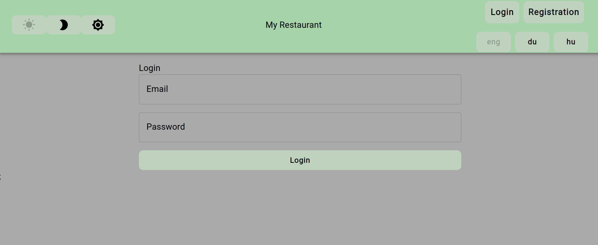

# Single-page webapplication

- Welcome to Catering App! This is a Single Page webapplication written in **React**, using **Typescript**, developed as part of my 5'th semester SPA course at Babes Bolyai University. It serves as a frontend for a Restaurant, but is tightly integrated with Java Spring backend server. [See Github repo](https://github.com/jdanyy/cateringApp-javaSpring-backend)

- [See help section for testing with backend](<https://github.com/jdanyy/SPA-CateringApp/edit/main/README.md#Testing with backend>)

## Features

- The applicationp provides a **user friendly** interface.
- It is integrated with my Java Spring backend, so also provides an **authentication** possibility, with different user roles.(CLIENT, CHEF, ADMIN)
- There is also **theming** and **internationalization** in project which is syncronized with the user account.
  

## User Roles and Activities

### Client

- **View menus**: Can browse through all the available menus offered by restaurant

### Chef

- **Create new menus**: Can create new specific menus for the restaurant
- **View dishes**: Chef can see all the available dishes in the restaurant

### Admin

- **Create Dishes**: Admins has the authority to create new dishes, as they are the owners of the restaurant
- **View menus**: Admins also can browse through all the available menus

## Installing dependencies

- The project includes multiple dependencies.
- You can install these with `npm install` from root directory.
- You can check the `package.json` file for used depdencies.

## Running the application

- From the root directory just execute the following command: `npm start`
- This is configured to in background a `vite` tool for launch the application.

## Testing with backend

- You need to check in Java Spring github repo how to build and run that project. [See Github repo](https://github.com/jdanyy/cateringApp-javaSpring-backend)
- After the backend is running, you can start running your web application.

🚀 Happy catering! 🍽️
